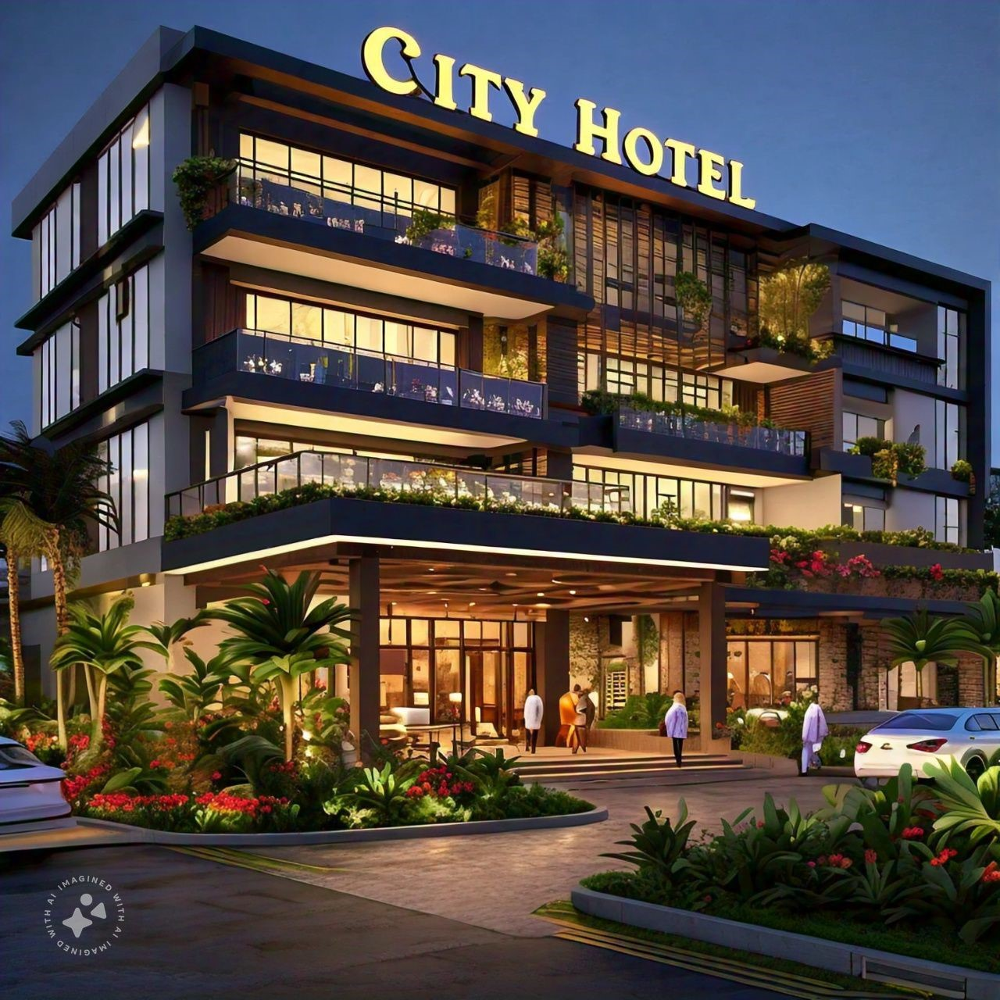

# Hotel-Bookings Analysis

___
## Introduction
This project was carried out to demonstrate how to import Excel file to SQL Server for manipulations, and then exported to Power BI for reports and interactive dashboard.

**_Disclaimer_**: _The dataset and all the reports in this analysis do not represent any real company or entity. It's just for demonstration of Excel skills_.

## Problem Statement
C & R Ltd has two types of hotels- City Hotels And Resort Hotels. The management wants to know if their hotel revenues are growing by year. Should increase parking lot size be increased? 

For the analysis, the problem statement is broken into specific evaluation questions:

1. Were the hotel revenues growing yearly for both hotel types?
   
2. Was there an increase in guests coming with personal cars?

3. What were the average daily rate and guests?

## Skills/Concepts Demonstrated
Microsoft Excel, SQL Server, and Power BI were used for this analysis. The following skills were demonstrated;

- Importing an Excel file to SQL Server
  
- Combining tables and creating a new column with SQL
  
- Using Power BI Report

- Creating an interactive dashboard

## Getting the Data
The file containing the data was downloaded from a website. You can access the file [here](https://absentdata.com/wp-content/uploads/2021/05/hotel_revenue_historical_full-2.xlsx).
 It has 5 worksheets: 2018, 2019, 2020, Meal and Market_Segment. 

## Investigating the Data
The dataset was checked for relevance to the evaluation questions. Also, the use of the data did not breach any data-related laws.

## Preparing the Data/ Data Transformation
- HotelBookings database was created for the analysis. The file was imported into SQL Server as tables.
- The tables were combined with "UNION".
- A column, revenue, was created.

## Analysis and Visualizations
Power BI was used for analysis for further analysis. Measures like average adr, total_nights and parking_space_percent were created.
To visualize the trends and patterns in the analysis, Card, Line chart, Donut chart and table were used.

### Interactive Dashboard 

.png)   

### Findings:

- Revenues appeared to be increasing in August but declining in December.
- 2019 revenue was the highest, followed by 2020 and that of 2018 was the lowest.
- The yearly percentage increase in guests who came with personal cars was approximately 2%.

## Conclusion and Recommendations

From the dataset, many questions could still be answered. As for this analysis, here are my recommendations based on the findings:
1. It is advisable not to spend on parking space for now. The reason is because percentage increase in guests coming with personal cars was just about 2%.
2. There should be less workers going on leave in August. 
   
